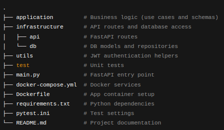
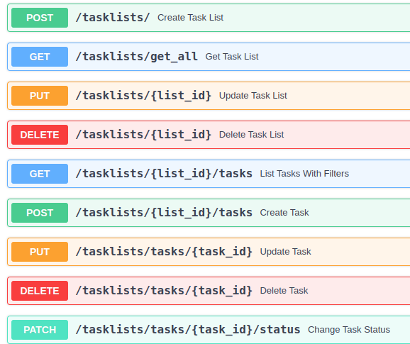

## Task Manager
This is a simple Task Manager API built with FastAPI, MySQL, and Docker.
The project uses clean architecture with separate layers for API, application logic, and database access
This app allows the created user to log in and create a general task name and connect it to a set of related tasks, having a one-to-many relationship in that sense.
The project has a set of services that provided these actions, these will be explained later.

# 🚀  Project Features

### Create and manage user accounts

### Create and manage task lists

### Authentication with JWT

### Database integration with MySQL

### Tests with Pytest

📁 Project Structure



# ⚙️ Requirements
* Python 3.10+
* Docker version 24.0.7 +
* docker-compose version 1.29.2 +


# 🔐 Authentication
This app uses JWT.
To access protected routes:

login to get a token.

Use the token in the Authorization: Bearer <token> header.

# 🛠 Environment Variables

* created a .env file at root 
* You can set them in a .env file:
```
DB_USER="your db user"
DB_PASSWORD="your password"
DB_HOST=db
DB_PORT=3306
DB_NAME="name you want"
ACCESS_TOKEN_EXPIRE_MINUTES=token time expire in minutes
```

# ✅ Example Endpoints
```
Method	Endpoint	Description
POST	(http://127.0.0.1:8000/users/register)	Register new user
POST	http://127.0.0.1:8000/users/login   	Get JWT token
POST	http://localhost:8000/tasklists/    	Create a task list
GET	    http://127.0.0.1:8000/tasklists/1/tasks?status=in_progress&priority=high  Get
                                                                                 conditional task
* You can see the description of all APIs in swagger documentation ->  http://localhost:8000/docs
* When logging in, a token will be returned which must be used to call the rest of the endpoints.


```


# ✅ Run in local
clone the project and at the project root run:

linux ubuntu

``` uvicorn main:app --reload ```

Note: If you want to configure with another database locally,
remember to change `db_HOST=<url-database> ` in the .env file

# 🐳 Run with Docker
Clone the project and at the root of the project run:
``` 
docker-compose up --build
use postman as client (postman optional)
using http://localhost:8000/<PATH>
PATH : To see the path visiting` http://localhost:8000/docs`

This action will create two containers, one with the application and the other with a MYsql database
```

🧪 Run Tests
  at the root of the project run:
```
pytest test -v 
```